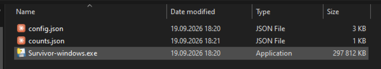
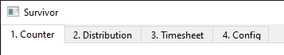
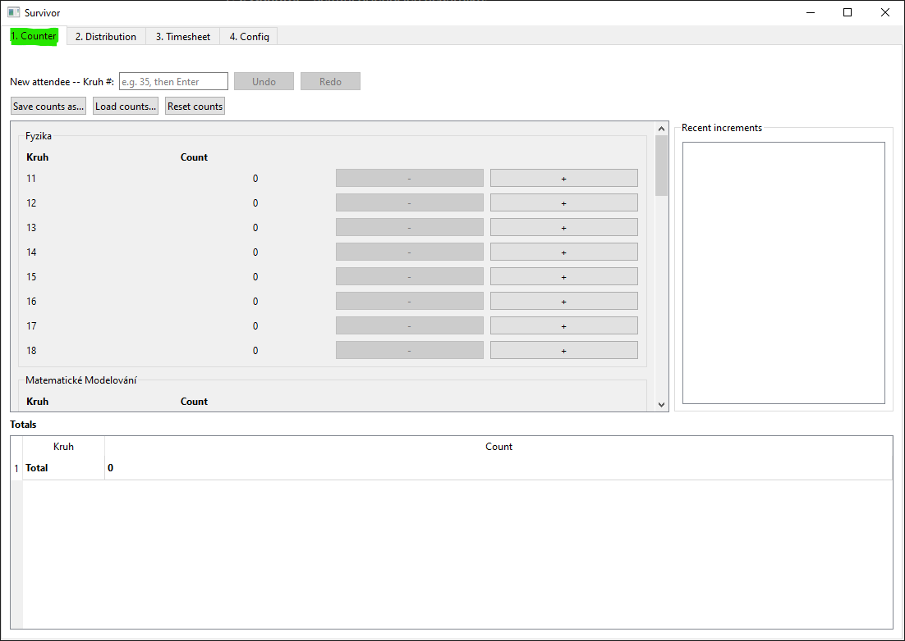
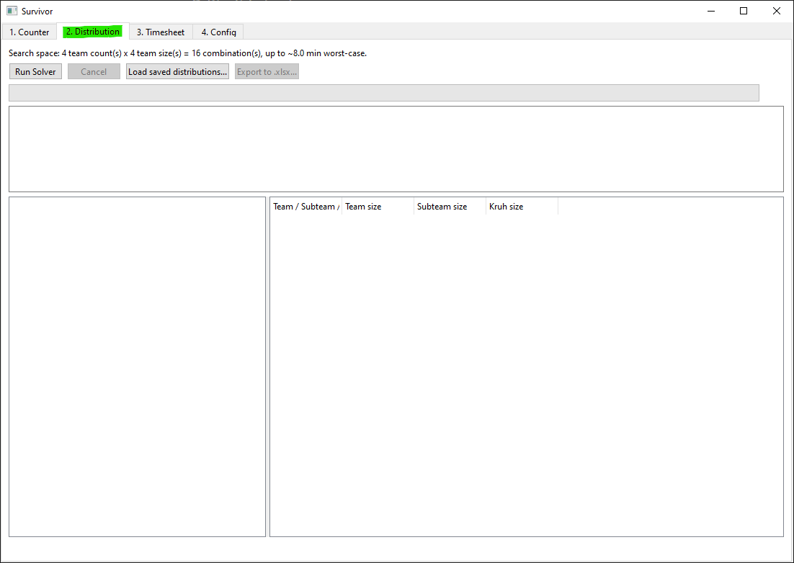
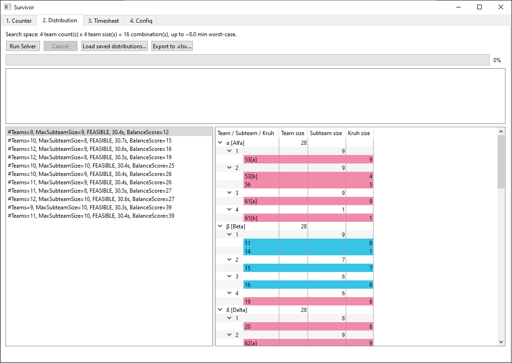
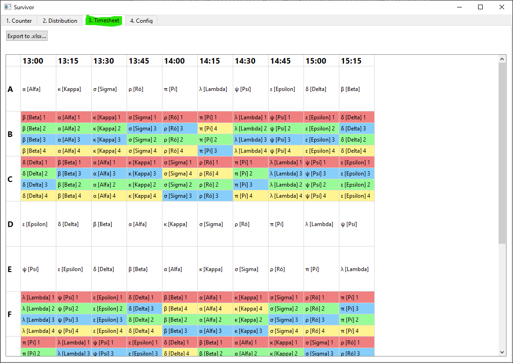
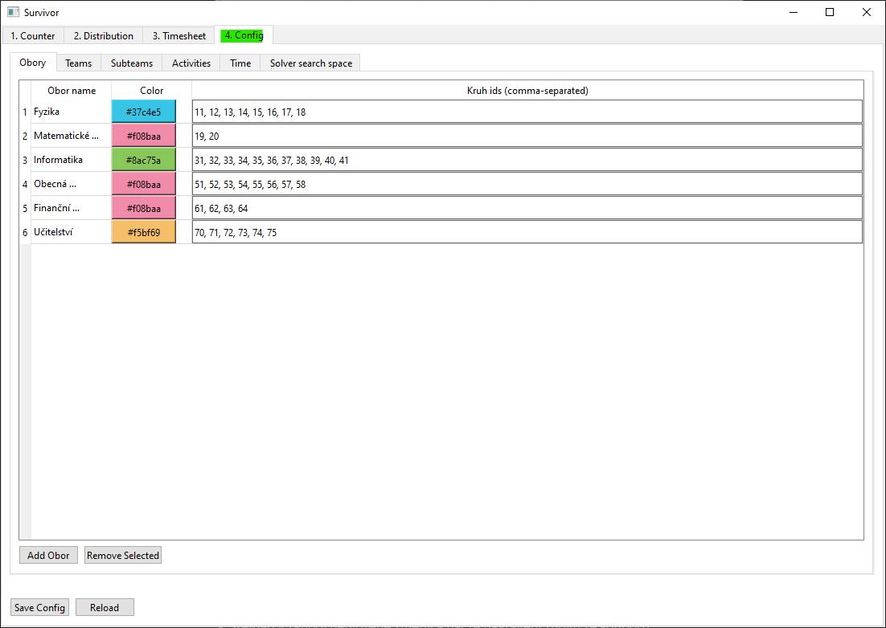

# Survivor – uživatelská příručka

## Úvod

Aplikace **Survivor** slouží k organizaci týmové akce Survivor: spočítá příchozí účastníky, rozdělí je do Teamů a Subteamů a vygeneruje rozvrh dne. Tato příručka je určena pro netechnického uživatele, který bude aplikaci obsluhovat v den akce, i pro toho, kdo si předem připraví konfiguraci.

Manuál popisuje aplikaci krok za krokem tak, jak je vidět na obrazovce.

**Základní pojmy** (ponechány v původním znění, nepřekládají se):

- **Obor** – studijní obor (např. Fyzika, Informatika).
- **Kruh** – studijní kroužek v rámci Oboru, označený číslem (např. 11, 35). Je to základní jednotka, která se rozděluje do Teamů.
- **Team** – hlavní tým akce (např. „α [Alfa]“).
- **Subteam** – podskupina v rámci každého Teamu, používaná pro aktivity typu „split“.
- **Activity** – blok v rozvrhu; je buď pro celý Team („all“), rozdělený po Subteamech („split“), nebo volno („rest“).

## Instalace a spuštění

**Nejjednodušší způsob (doporučeno):**

1. Stáhněte si aplikaci ze stránky [Releases · Krtiiik/Survivor-Utilities](https://github.com/Krtiiik/Survivor-Utilities/releases) – soubor pro Windows (.exe) nebo binárku pro Linux (bez přípony).
2. Spusťte dvojklikem. Není potřeba instalovat Python ani nic dalšího.

Při prvním spuštění si aplikace vedle sebe (vedle .exe souboru) vytvoří soubory `config.json` (nastavení akce) a `counts.json` (napočítané osoby), pokud tam ještě nejsou. Pokud `config.json` chybí, založí se výchozí ukázková konfigurace, kterou je potřeba před akcí upravit na záložce **Config**.

**Důležité:** aplikace ukládá vše do souborů vedle sebe. Když aplikaci přesunete do jiné složky, přesuňte s ní i `config.json` a `counts.json`.

**Pokročilý způsob (pro vývojáře se znalostí Pythonu):**

1. Stáhněte nebo naklonujte zdrojový kód aplikace z GitHubu (větev/tag podle potřeby).
2. Nainstalujte Python a závislosti příkazem `pip install -r requirements.txt`.
3. Spusťte aplikaci příkazem `python app.py`.

Aplikace se pak chová stejně jako spuštěná z .exe/binárky – soubory `config.json` a `counts.json` se vytvoří vedle `app.py`.

## Přehled rozhraní

Po spuštění se zobrazí jedno okno se čtyřmi záložkami nahoře:

1. **1. Counter** – sčítání příchozích účastníků.
2. **2. Distribution** – rozdělení do Teamů a Subteamů.
3. **3. Timesheet** – náhled a export rozvrhu.
4. **4. Config** – nastavení celé akce.

Záložky nejsou „průvodce“ – lze mezi nimi přeskakovat v libovolném pořadí (např. i v průběhu akce se dá znovu přepočítat rozdělení nebo přegenerovat rozvrh). Záložky **Distribution** a **Timesheet** jsou nedostupné (šedé), dokud není nastavení na záložce **Config** v pořádku – v takovém případě dole ve stavovém řádku uvidíte hlášku, že je potřeba nastavení opravit.

## Záložka 1: Counter (sčítání účastníků)

Slouží k počítání účastníků podle Kruhů v den akce.

**Jak sčítat:**

- U každého Kruhu (seskupené podle Oboru) klikněte na tlačítko **+** při příchodu osoby, na **-** při odchodu/opravě.
- Rychlejší varianta: napište číslo Kruhu do pole nahoře (např. „35“) a stiskněte Enter – přičte se jedna osoba k danému Kruhu.
- Aktuální počty se ukládají automaticky po každé změně do souboru `counts.json` – není potřeba nic ručně ukládat.

**Další ovládací prvky:**

- **Recent increments** (seznam posledních změn) – u každé změny lze použít **Undo**/**Redo**, pokud se někdo splet.
- **Save counts as...** – uloží aktuální počty do vlastního souboru (např. jako zálohu před přestávkou).
- **Load counts...** – nahradí aktuální počty počty z vybraného souboru.
- **Reset counts** – vynuluje všechny počty. Aplikace se před touto akcí i před načtením jiného souboru vždy zeptá na potvrzení.

> **Pozor:** i po použití „Save counts as...“ nebo „Load counts...“ aplikace dál automaticky ukládá do stejného výchozího souboru `counts.json`.

## Záložka 2: Distribution (rozdělení do Teamů)

Zde se Kruhy (podle aktuálních počtů ze záložky Counter) automaticky rozdělí do Teamů a Subteamů.

**Postup:**

1. Klikněte na **Run Solver**. Výpočet může chvíli trvat (desítky sekund) – lze jej kdykoliv přerušit tlačítkem **Cancel**.
2. Po dokončení se zobrazí jedna nebo více nabízených variant rozdělení (kandidátů). Vyberte tu, která vyhovuje.
3. V zobrazené tabulce lze myší přetáhnout jednotlivé Kruhy mezi Teamy a Subteamy a výsledek tak ručně doladit – velikosti Subteamů se přepočítávají okamžitě.

- Pokud se u Kruhu zobrazí ⚠, jde jen o upozornění (ne chybu) – znamená to, že velký Kruh byl rozdělen na části a jeho části skončily v různých Teamech. Lze to i tak ponechat, je to čistě na zvážení.
- **Export to .xlsx...** – uloží vybrané (případně ručně upravené) rozdělení jako Excel soubor, který lze dál volně upravovat.
- **Load saved distributions...** – načte kandidáty z dřívějšího běhu výpočtu (každý běh se automaticky uloží do `distributions.json`, ale znovu se nenačítá sám – použijte toto tlačítko).
- Pokud se po spuštění výpočtu objeví hláška „Config changed – please re-run the solver“, znamená to, že se od posledního výpočtu změnilo nastavení na záložce Config a je potřeba výpočet spustit znovu.

## Záložka 3: Timesheet (rozvrh)

Zobrazuje náhled rozvrhu celé akce – které Aktivity dělá který Team/Subteam a v kolik hodin. Rozvrh vychází pouze z nastavení na záložce **Config** (nezávisí na tom, co je rozdělené na záložce Distribution).

- Náhled se aktualizuje automaticky podle nastavení Config.
- **Export to .xlsx...** – uloží rozvrh jako Excel soubor pro tisk.

## Záložka 4: Config (nastavení)

Zde se nastavuje vše, co ovlivňuje sčítání, rozdělení i rozvrh – Obory, Teamy, Subteamy, Aktivity a časování. Nastavení se ukládá do souboru `config.json`.

Podzáložky:

- **Obory** – seznam Oborů, jejich Kruhy (čísla) a barva pro zobrazení.
- **Teams** – názvy Teamů.
- **Subteams** – názvy a barvy Subteamů.
- **Activities** – seznam aktivit v pořadí, v jakém proběhnou, a jejich typ (all / split / rest).
- **Time** – čas začátku akce a délka jednoho bloku Aktivity.
- **Solver search space** – kolik Teamů a jak velké Subteamy má výpočet na záložce Distribution zkoušet.

**Uložení:**

- **Save Config** – uloží změny do `config.json`. Pokud nastavení není v pořádku, tlačítko uložení odmítne a nahoře se vypíše seznam chyb, které je potřeba nejdřív opravit.
- **Reload** – zahodí neuložené změny a načte nastavení znovu ze souboru.

Dokud nastavení není v pořádku (viz chybová hláška), zůstávají záložky **Distribution** a **Timesheet** nedostupné.

## Řešení běžných problémů

**Záložky Distribution/Timesheet jsou šedé a nejdou otevřít.** Nastavení na záložce Config není v pořádku. Přepněte se na Config a opravte chyby vypsané po kliknutí na Save Config.

**Run Solver nenajde žádné rozdělení (žádný kandidát).** Zkuste na záložce Config → Solver search space rozšířit možné počty a velikosti Teamů/Subteamů – aktuální kombinace nemusí pro daný počet lidí stačit.

**Někdo omylem smazal/přepsal počty na Counteru.** Použijte **Load counts...** a načtěte poslední zálohu vytvořenou přes „Save counts as...“, případně původní `counts.json` z předchozí zálohy dat.

**Zavřel(a) jsem aplikaci, přišla jsem o data?** Ne – počty se ukládají po každém kliknutí automaticky. Konfigurace se ukládá při kliknutí na Save Config. Rozdělení z Distribution se ukládá po každém běhu výpočtu do `distributions.json` a lze ho znovu načíst přes „Load saved distributions...“.

**Kam se ukládají soubory?** Vždy do stejné složky, kde je spuštěná aplikace (vedle .exe, nebo vedle app.py při spuštění ze zdrojového kódu): `config.json`, `counts.json`, `distributions.json` a exportované .xlsx soubory.
